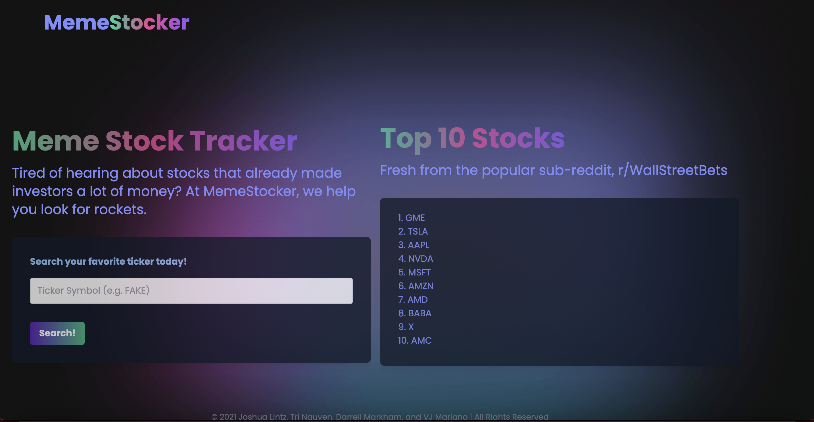

# meme-stocker

MemeStocker is a Meme Stock tracker that pulls the Top 10 tickers from the Reddit subreddit - Wallstreetbets. The goal of the application is to equip retail investors interested in the meme stock trend with the top trending tickers.

## Links
* Live Site: TBD
* Code Repo: https://github.com/tringuyen1086/meme-stocker

## Built With
* HTML
* [Tailwind CSS](https://tailwindcss.com/)
* [JQuery](https://jquery.com/)
* [JavaScript](https://www.javascript.com/)
* [Wallstreetbets API](https://tradestie.com/apps/reddit/api/)
* [Yahoo! Finance API](https://www.yahoofinanceapi.com/)

## User Story

As a retail investor, I would like a simple way to see which meme stocks are trending within the WallStreetBets subreddit so that I can more easily leverage this consumer sentiment to assist in my “yolo” investment decisions.

## Acceptance Criteria

TBD

## Grading Requirements

This project is graded based on the following criteria:

* Technical Acceptance Criteria: 25%
    * Satisfies the following code requirements:
        * Application uses at least two server-side APIs.
        * Application uses client-side storage to store persistent data.
        * Application doesn't use JS alerts, prompts, or confirms (uses modals instead).
        * Application uses a CSS framework other than Bootstrap.
        * Application is interactive (accepts and responds to user input)
* Concept: 10%
    * Application should be a unique and novel idea.
    * Your group should clearly and concisely articulate your project idea.
* Deplopyment: 20%
    * Application deployed at live URL and loads with no errors.
    * Application GitHub URL submitted.
    * Portfolio at live URL submitted, featuring project.
* Repository Quality: 10%
    * Repository has a unique name.
    * Repository follows best practices for file structure and naming conventions.
    * Repository follows best practices for class/id naming conventions, indentation, quality comments, etc.
    * Repository contains multiple descriptive commit messages.
    * Repository contains quality README file with description, screenshot, and link to deployed application.
* Presentation: 10%
    * Your group should present using Powerpoint or a similar presentation software.
    * Every group member should speak during the presentation.
    * Your presentation should follow the Project [Presentation Template](https://docs.google.com/presentation/d/10QaO9KH8HtUXj__81ve0SZcpO5DbMbqqQr4iPpbwKks/edit#slide=id.p).
* Collaboration: 10%
    * There are no major disparities in the number of GitHub contributions between group members.

## How to Submit the Challenge

You are required to submit BOTH of the following:
* The URL of the deployed application.
* The URL of the GitHub repository. Give the repository a unique name and include a README describing the project.